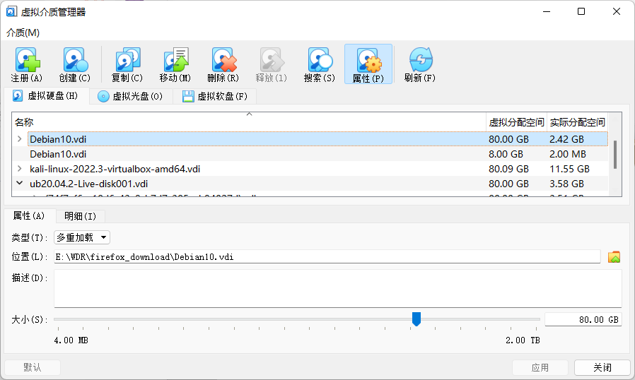
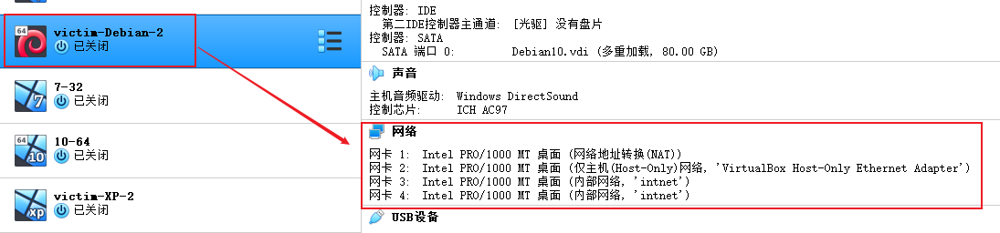
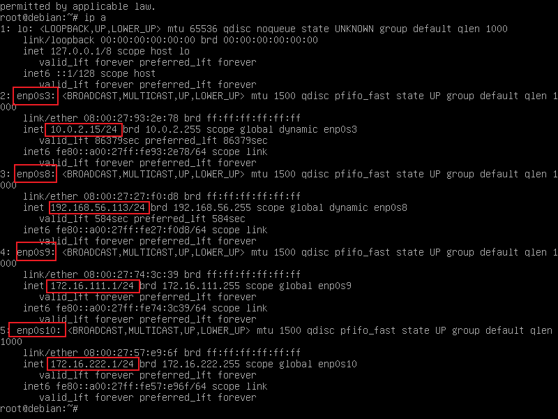
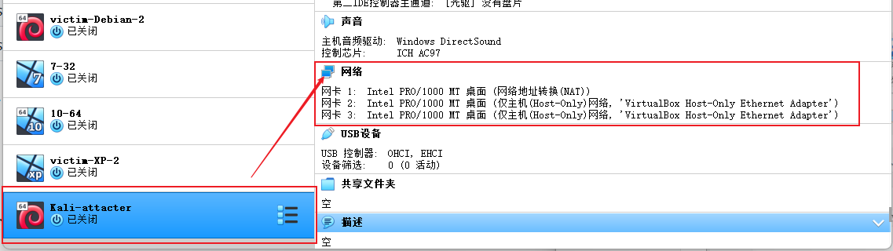
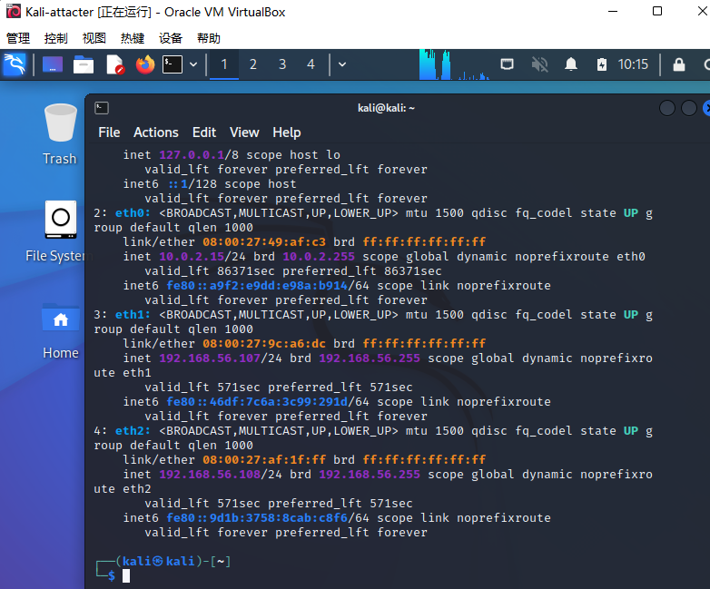
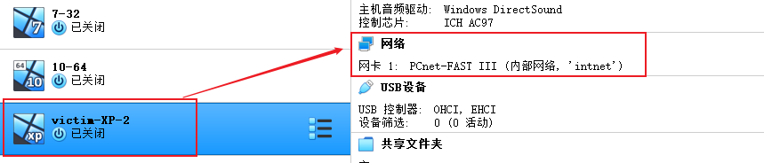
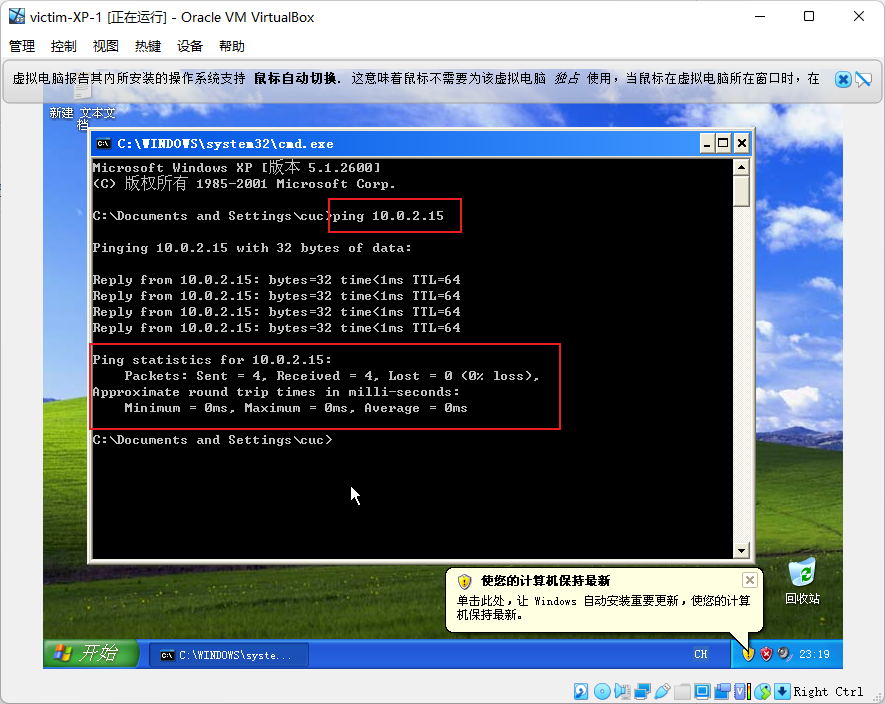
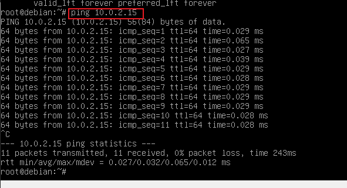
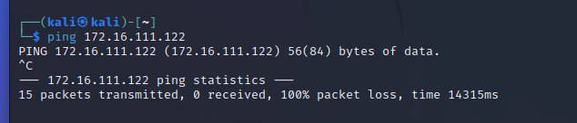
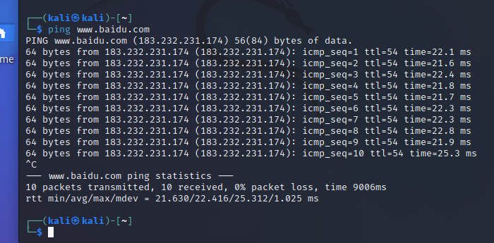

# 基于 VirtualBox 的网络攻防基础环境搭建

## 实验目的

- 掌握 VirtualBox 虚拟机的安装与使用；
- 掌握 VirtualBox 的虚拟网络类型和按需配置；
- 掌握 VirtualBox 的虚拟硬盘多重加载；

## 实验环境

以下是本次实验需要使用的网络节点说明和主要软件举例：

- VirtualBox 虚拟机
- 攻击者主机（Attacker）：Kali Rolling 2019.2
- 网关（Gateway, GW）：Debian Buster
- 靶机（Victim）：From Sqli to shell / xp-sp3 / Kali

## 实验要求

- 虚拟硬盘配置成多重加载，效果如下图所示；

- 搭建满足如下拓扑图所示的虚拟机网络拓扑；

> 根据实验宿主机的性能条件，可以适度精简靶机数量

- 完成以下网络连通性测试；
  - [x] 靶机可以直接访问攻击者主机
  - [x] 攻击者主机无法直接访问靶机
  - [x] 网关可以直接访问攻击者主机和靶机
  - [ ] 靶机的所有对外上下行流量必须经过网关
  - [ ] 所有节点均可以访问互联网

## 实验过程

### 1. 配置多重加载

- 修改方法：管理 -> 虚拟介质管理 -> 虚拟硬盘 -> 选择需要的 vdi 文件 -> 属性 -> 将类型修改为多重加载。
- 将 `Debian10.vdi` 、`kali-linux-2022.3-virtualbox-amd64.vdi` 、`xp_sp3_base.vdi` 设置成多重加载。

### 2. 搭建虚拟机网络拓扑

- 网关所需网卡：NAT网络（为了使网关可以访问攻击者主机），Host-only网络（可以进行网卡的设置），两块内部网络（分别用于搭建两块独立的局域网）

- 
  攻击者所需网卡：NAT网络，两块不同的Host-only网络

- victim（被攻击者）所需网卡：均为内部网络，使其分为两组，分别在不同的局域网内

- **设置网卡**：

  - victim-Debian:

    

    

  - Kali-attacter:

    

    

    | 网卡名称 | Virtual Box 中的网络类型 | IP地址         |
    | -------- | ------------------------ | -------------- |
    | eth0     | NAT 网络                 | 10.0.2.15      |
    | eth1     | Host-Only                | 192.168.56.107 |
    | eth2     | Host-Only                | 192.168.56.108 |

  - Victim-xp-1:

    

  - Victim-xp-1：

    

    

### 3. 完成网络连通性测试

#### 1. 靶机可以直接访问攻击者主机

`Victim-XP-1` 访问 `Kali-attacter`：

#### 2. 攻击者主机无法访问靶机

测试结果如下图所示：

- `Kali-attacter`访问靶机时无回应，说明无法其访问靶机。

#### 3. 网关可以直接访问攻击者主机和靶机

`victim-Debian-2` 访问 `Kali-attacter`，可以ping通则说明可以访问：

#### 4. 靶机的所有对外上下行流量必须经过网关

#### 5. 所有节点均可以访问互联网

- `kali-attacter`ping百度网站，可以访问互联网：

## 参考

课件+课堂演习
